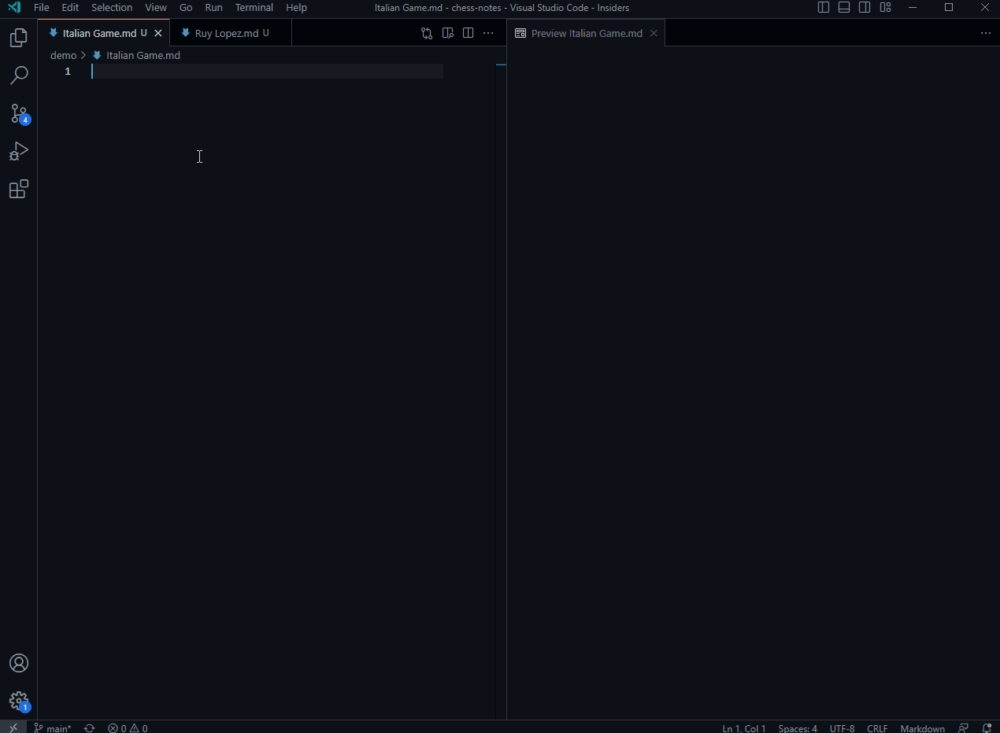

# VSCode Markdown Chess Viewer

Display chess boards in vscode markdown viewer.



## Usage

Create an empty chess board by writing a chess code block:

````markdown
```chess

```
````

On an empty board you can move pieces and draw arrows/squares and copy it back to the chess code block, as shown in the GIF.

You can supply an initial FEN, and arrows/squares to mark on the board, and a board size:

````markdown
```chess
fen: r1bqkbnr/pppp1ppp/2n5/1B2p3/4P3/5N2/PPPP1PPP/RNBQK2R w KQkq - 0 1
arrows: f3->e5 b5->c6
squares: g5 f7
size: 350px
```
````

Full list of supported properties:

| **Property**    | **Description**                  | **Possible values**  | **Default**                         |
| --------------- | -------------------------------- | -------------------- | ----------------------------------- |
| **fen**         | The initial position             | Any valid FEN string | Initial                             |
| **arrows**      | Series of arrows to draw         | e2->e4 d2->d4        | Empty                               |
| **squares**     | Series of squares to mark        | e5 d5                | Empty                               |
| **orientation** | Which side to view the board     | white / black        | white                               |
| **size**        | Board width size in px (150-600) | 200px                | 280px                               |
| **movable**     | Force to enable/disable movement | true / false         | false if FEN supplied               |
| **drawable**    | Force to enable/disable drawing  | true / false         | false if arrows or sqaures supplied |
| **lastMove**    | Highlight last move              | e2 e4                | Undefined                           |

## Themes

Multiple board themes and piece sets are supported. Currently the extension has limited resources available, because they already increase the extension's size significantly.

You can change themes in the extension's settings, or via the `Markdown: Open Chess Settings` command.

### Piece sets

- [merida](https://github.com/lichess-org/lila/blob/master/public/piece/merida/bK.svg) (default)
- [cburnett](https://github.com/lichess-org/lila/blob/master/public/piece/cburnett/bK.svg)
- [alpha](https://github.com/lichess-org/lila/blob/master/public/piece/alpha/bK.svg)

### Boards

- [brown](https://github.com/lichess-org/lila/blob/master/public/images/board/svg/brown.svg) (default)
- [blue](https://github.com/lichess-org/lila/blob/master/public/images/board/svg/blue.svg)
- [green](https://github.com/lichess-org/lila/blob/master/public/images/board/svg/green.svg)
- [ic](https://github.com/lichess-org/lila/blob/master/public/images/board/svg/ic.svg)
- [purple](https://github.com/lichess-org/lila/blob/master/public/images/board/svg/purple.svg)

## License

This project is based on the [Chessground](https://github.com/lichess-org/chessground) and [Chessops](https://github.com/niklasf/chessops) libraries by lichess in order to render the chess board and play moves, so I had to use the GPL-3.0 license for this project too.

## TODO

- [ ] init null class members with var declaration not in constructor
- [ ] declare members in constructor
- [ ] view chess variants in pgn block
- [ ] handle FEN/PGN parse error
- [ ] Point to the right markdown text when clicking on chess board
- [ ] Support jpg/png board backgrounds
- [ ] Support 3d pieces

## Known Issues

## Contributing

`vscode-markdown-chess` is developed on GitHub at [eronne/vscode-mardown-chess](https://github.com/eronnen/vscode-markdown-chess). Feel free to add PRs, issues and feature request on the [issues](https://github.com/eronnen/vscode-markdown-chess/issues) page.

---
